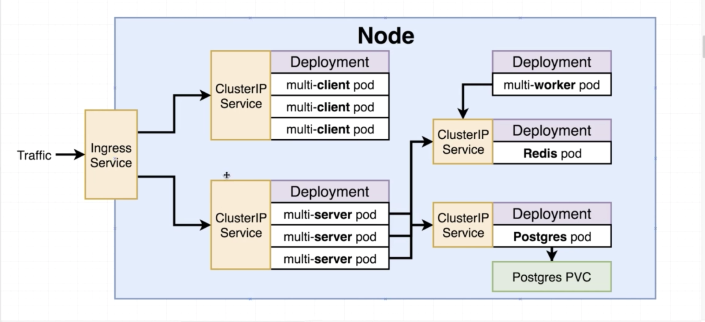

# Multi Container App with Kubernetes

The main idea of this project is to migrate the previous created [Multi Container App inside the 05-complex folder](../05-complex/README.md), to Kubernetes.

## Objective:


## ingress-nginx

This project uses ingress-nginx. To 'install' it:

`kubectl apply -f https://raw.githubusercontent.com/kubernetes/ingress-nginx/controller-v0.44.0/deploy/static/provider/cloud/deploy.yaml`

## Installing Kubernetes Dashboard

1. curl https://raw.githubusercontent.com/kubernetes/dashboard/v2.2.0/aio/deploy/recommended.yaml > kubernetes-dashboard.yaml
2.  Open up the downloaded file in your code editor and use CMD+F or CTL+F to find the args. Add the following two lines underneath --auto-generate-certificates:

```
args:
  - --auto-generate-certificates
  - --enable-skip-login
  - --disable-settings-authorizer
```
3. Run the following command inside the directory where you downloaded the dashboard manifest file a few steps ago:

`kubectl apply -f kubernetes-dashboard.yaml`

4. Start the server by running the following command:

`kubectl proxy`

5. You can now access the dashboard by visiting:

http://localhost:8001/api/v1/namespaces/kubernetes-dashboard/services/https:kubernetes-dashboard:/proxy/

6. You will be presented with a login screen, click the "SKIP" link next to the SIGN IN button.

7. You should now be redirected to the Kubernetes Dashboard.

**Important!** The only reason we are bypassing RBAC Authorization to access the Kubernetes Dashboard is that we are running our cluster locally. You would never do this on a public-facing server like Digital Ocean and would need to refer to the official docs to get the dashboard setup.

If you wish to instead create a sample user, you can follow the instructions here:

https://github.com/kubernetes/dashboard/blob/master/docs/user/access-control/creating-sample-user.md


