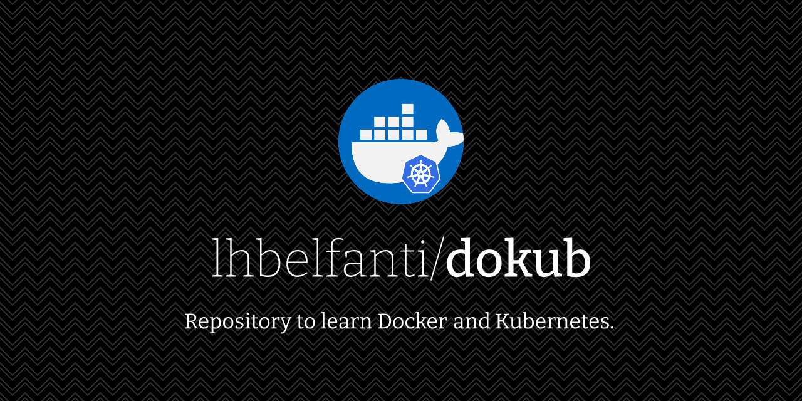

  <picture>
    <source media="(prefers-color-scheme: dark)" srcset="media/dokub-dark.png">
    <source media="(prefers-color-scheme: light)" srcset="media/light.png">
    
  </picture>

   

  
  

## Content
It is composed by __**7**__ different projects listed below. Each one of them increases the complexity of the previous one, integrating the different concepts of the course: **Docker, containers, Docker Compose, Kubernetes, Nginx, Travis CI and AWS / Google Cloud Platform**.

### 1. Redis Image
The most basic of the projects. First use of Docker. It creates a container with an image of redis.

### 2. Simple Web
It creates a simple Express web server using an alpine image and explaining the basic Docker commands.

### 3. Visits
Introduction to Docker Compose. It is an application that creates a web and counts the number of times the web has been visited.

### 4. Frontend
Basic React app that goes deeper in the explanation of Docker and Docker Compose, creating a Dockerfile.dev to manage the configuration for the development environment.

It uses AWS to host the application. And Travis CI to deploy it.

Project [README.md](./04-frontend/README.md)

### 5. Complex
A more complex project using Docker, Docker Compose, Travis CI and AWS. It is divided in several containers and uses nginx to route the traffic between them.

Project [README.md](./05-complex/README.md)

### 6. SimpleK8S
First look at Kubernetes. It explains the basics.

Project [README.md](./06-simplek8s/README.md)

### 7. Complex with K8S
Migration of the [5. Complex](#5.-complex) project to Kubernetes.

Project [README.md](./07-complex-with-k8s/README.md)

---
## License

[MIT](https://choosealicense.com/licenses/mit/)
